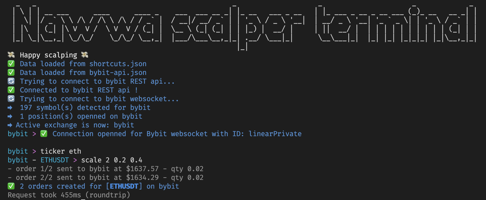
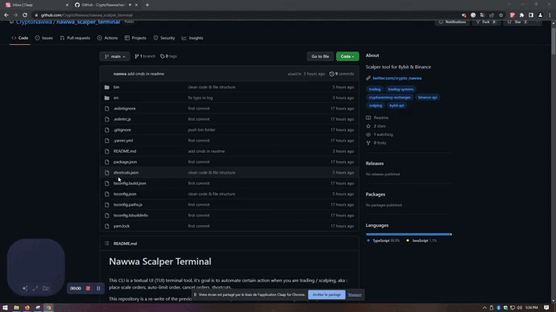

####

This CLI is a textual UI (TUI) terminal tool, it's goal is to automate certain action when you are trading / scalping, aka : place scale orders, auto-limit order, cancel orders, shortcuts..

This repository is a re-write of the previous tool I made ([nawwa-scalper-tool](https://github.com/CryptoNawwa/nawwa_scalper_tool)) which was written in Python (meh).

This version is fully written in Typescript 🚀 and support the following exhanges:

- Binance ✅
- Bybit ✅

> Note: The code was made so it's easy for a developer to implement any new exchange

#### Socials & Tip Jar

Twitter : [@crypto_nawwa](https://twitter.com/crypto_nawwa)  
Discord : **Nawwa#8129**  
**_TIP JAR_**
erc-20 : `0xc44823Cda133B49cb7F91B5cFa517FA76d3Ae561`

# Demo

Auto take profit system on Binance  

https://user-images.githubusercontent.com/113562325/216424210-fb78d369-9967-427e-9d82-d8858f6243b7.mp4

Switch between Binance & Bybit  

https://user-images.githubusercontent.com/113562325/216424414-af4415cd-c5c9-4c7d-bc4c-afa07a9ff00e.mp4


# Features

- **_Bybit_** & **_Binance_** support
- Easy switch between exchanges
- Display current active ticker & active exchange in terminal UI
- Place scale reduce-only limit orders based on .% range away from entry
- Place 1 (one) reduce only limit order, based on .% away from entry
- **_Automatic take-profit_** system, on activation, the terminal will automatically place pre-configured scale or single order(s) whenever it detect a new position, on ANY symbols you trade
- Cancellation of recent orders
- Create/Update shortcuts (shortcuts are alias for your commands)
- CLI history (press up and down arrows)
- CLI autocomplete (press tab)

### What I'm working on

- Automatic detection of tab switching or symbol switching from [Quantower](https://www.quantower.com/), [Tealstreet.io](https://trade.tealstreet.io/trade) & [InsilicoTerminal](https://insilicoterminal.com/#/)
- Place order at best bid/ask

> Feel free to suggest anything

# How to install

## Standalone app ready to run

You can download the `nawwa-scalper-terminal` app directly from here :

- [Windows](https://github.com/CryptoNawwa/nawwa_scalper_terminal/raw/main/bin/nawwa-scalper-terminal-win.exe)
- [MacOs](https://github.com/CryptoNawwa/nawwa_scalper_terminal/raw/main/bin/nawwa-scalper-terminal-macos)
- [Linux](https://github.com/CryptoNawwa/nawwa_scalper_terminal/raw/main/bin/nawwa-scalper-terminal-linux) - (not tested yet)

**_Demo on how to install the app on windows:_**



#### **Extra Steps on Windows**

**Strongly recommended** : Install the terminal called [ Windows Terminal ](https://apps.microsoft.com/store/detail/windows-terminal/9N0DX20HK701), the `nawwa-scalper-terminal` has some cool emojies and colors, they might not work in basic terminal.

To launch the `nawwa-scalper-terminal`:

- Just double click the app
- However, if it opens and closes real quick :
  - then open a cmd (terminal) window, and drag `nawwa-scalper-terminal-win.exe` and drop it into the black of the cmd (terminal) window
  - can also open cmd window and type: `cd Desktop` (or wherever you put it) and then type: `nawwa-scalper-terminal-win.exe` to run it.

#### **Extra Steps on MacOS or Linux**

If you are familiar with our beloved friend [Ichibot](https://gitlab.com/Ichimikichiki/ichibot-client-app), this is just like it, I will shamelessly copy-past some of his instructions :

Open a terminal and and navigate to wherever you put the `nawwa-scalper-terminal`

- `cd Downloads` (Or whatever directory `nawwa-scalper-terminal` is in)
- `chmod +x nawwa-scalper-terminal-macos`
  or for linux :
- `chmod +x nawwa-scalper-terminal-linux`

Then:

- just `double click on the app` to launch
- alternatively, type in your terminal: `./nawwa-scalper-terminal-macos`
  or for linux:
- type: `./nawwa-scalper-terminal-linux`

## Build from source yourself

I will detail this more in the futre, for the moment you can do:

- Download the [Source code](https://github.com/CryptoNawwa/nawwa_scalper_terminal/archive/refs/heads/main.zip)
- Unzip it somewhere you can find easily
- Install `NodeJS` -> https://nodejs.org/en/download/
- Install `yarn` -> https://classic.yarnpkg.com/lang/en/docs/install/#mac-stable
- Open any terminal, navigate into the project directory
- `cd <wherever_you_unziped_the_source_code>/nawwa_scalper_terminal-main`
- Then type
  - `yarn install` (it will install dependencies)
  - `yarn start` (it will start the app)

That's it !
To run the project in the future :

- `cd nawwa-scalper-terminal`
- `yarn start`

# Shortcuts / Aliases

To add / remove shortcuts, open the `shortcuts.json` file located next to the app.

Shortcut file syntax is :

```json
{
  "name_of_shortcut": "command",

  "name_of_shortcut_2": "command"
}
```

Example of a shortcut file :

```json

{

"s1": "scale 5 0.01 0.03",

"s2": "scale 5 0.02 0.04",


"tp1": "tp 0.1",

"tp4": "tp 0.3",


"atp4": "atp ON tp4",
"atp4": "atp ON s1",


"t": "ticker",
"p": "positon",
"bb": "connect bybit",
"bn": "connect binance"

"sol": "ticker sol",
"eth": "ticker eth",
"btc": "ticker btc"

}

```

Pretty simple:

- when you type `bb` in the terminal, it will execute `connect binance`
- when you type `t btc` in the terminal, it will replace `t` by `ticker` and execute `ticker btc`
- when you type `atp4` in the terminal, it will execute `atp ON tp4`

You can add / update aliases and shortcut directly from the terminal, see the `shortcut`command info below, or type `help shortcut` in the terminal

_Note : Shortcut are used by the `atp` command, see later._

# Availables commands

- `help`
- `connect`
- `disconnect`
- `switch`
- `scale`
- `atp`
- `position`
- `shortcut`
- `cancel`
- `ticker`

You can type `help` in the app and it will display the list of all available commands and how to use it.

If you want to see more detail about a certain command you can type `help <command_name>` and it will display a detailed description with examples :

```
> help scale
Usage:
- scale <nb_of_order> <from_%> <to_%>

Examples:
- 'scale 10 0.1 0.2' -> Will create 10 reduce-only orders on the active ticker, from 0.1% to 0.2% away from the entry price
- 'scale 2 0.5 0.8' -> Will create 2 reduce-only orders on the active ticker, from 0.5% to 0.8% away from the entry price
```

---

### **connect [binance | bybit]**

This command will connect to the given exchange

```sh

> connect binance

or

> connect bybit

```

Whenever there is no `bybit-api.json` or `binance-api.json` file, the terminal will ask you to enter your API and secret keys, it will then store the keys in a file.

Next time you use the command it will automatically use the keys from the file and connect to the exchange.

---

### **disconnect**

This command will disconnect from the current active exchange

```sh

> disconnect

```

The current active exchange is displayed in the terminal, using `disconnect` will disconnect the terminal from that exchange

---

### **ticker [ticker_name]**

This command switch the active ticker to a new one

```sh

> ticker ethusdt

or

> ticker eth

```

In this example, the command set the active ticker to `ETHUSDT`

The current active ticker is displayed on your terminal

_Note : You will need to have a ticker selected to execute certain command_

---

### **scale [nb_of_order] [from_%] [to_%]**

This command create `[nb_of_order]` reduce-only limit order(s) on the active ticker, from `[from_%]` above entry price to `[to*%]` above entry price (or below if short)

```sh

> scale 10 0.1 to 0.2

```

In this example, it will create 10 orders from 0.1% to 0.2%

_Note : For this command to work you need to have an open position on the active ticker_

---

### **tp [away_from_entry_%]**

This command create 1 (one) reduce-only limit order on the active ticker, from `[away_from_entry_%]` above entry_price (or below if short)

```sh
> tp 0.4
```

In this example, it will create 1 order from 0.4% away from entry price

_Note : For this command to work you need to have an open position on the active ticker_

---

### **cancel**

This command cancel the recent limit orders, for the current active ticker

```sh
> cancel
```

---

### **switch [bybit | binance]**

This command will switch the current active exchange

```sh
> switch binance
```

Will switch current active exchange to Binance

```sh
> switch bybit
```

Will switch current active exchange to Bybit

---

### **position [action]**

Available actions:

- refresh

This command list the current opened position for the current exchange, stored in the terminal

```sh
> position
```

Will list the current stored positions.  
Positions are gathered using Websockets, every time you enter a position the terminal will add it to the position list

```sh
> position refresh
```

Adding the `refresh` action will force the terminal to call the current active exchange and refresh the position list

---

### **shortcut [action] [shortcut_name]=[shortcut_value]**

This command will execute the given `[action]` with `[shortcut_name]` and `[shortcut_value]` as parameter

This command is usefull to add / modify shortcuts
Available actions:

- ADD

```sh
> shortcut ADD tp10=scale 4 0.5 0.9
```

In this example, a shortcut named `tp10` will be added to the `shortcuts.json` file, with the shortcut value being `scale 4 0.5 0.9`

Assuming the file was empty, after this command it will look like this :

```json
{
  "tp10": "scale 4 0.5 0.9"
}
```

Now, when you type `tp10` in the terminal, it will execute `scale 4 0.5 0.9`

---

### **atp [atp_action] [shortcut_name]**

This command will execute the given `[atp_action]` with `[shortcut_name]` as parameter

Actions availabe :

- ON

- OFF

- STATUS

**_atp_** command (for automatic take profit) will automatically set reduce-only limit orders based on the shortcut config you gave him.

:warning: Once it's `ON` , the `atp` system works for **all the positions you enter**, on every pair.  
It means that if you take a trade on another pair, it will place the limit order(s), it's not only related to the current active ticker (might change that later if it's a problem / or a request)

### **ON** example

Consider we have the following shortcut file :

```json
{
  "tp1": "scale 10 0.1 to 0.2"
}
```

```sh
> atp ON tp1
```

This will activate the **_atp_** system with the shortcut `tp1` as limit order config

It means, if we enter a position on any coin, the bot will execute `scale 10 0.1 to 0.2 `

- It will automatically set 10 limit orders from 0.1 to 0.2 each time you enter a position

_Note : Obviously, only use `scale` or `tp` shortcuts for atp command_
_Note : Shortcuts needs to be defined in the file located shortcuts.json_
_Note : To update a atp shortcut, use the ON action again_

### **OFF** example

```sh
> atp OFF
```

This will disable the `atp` system

### **STATUS** example

```sh
> atp STATUS
```

This will print the current status (**_ON_** / **_OFF_**)

# Support

If you need any help, follow & dm me on twitter [crypto_nawwa](https://twitter.com/crypto_nawwa) or add me on Discord **Nawwa#8129**

# Disclaimer

Downloading and using this bot is at your own risk, you take full responsibility and if you lose money it's your own fault. I recommend using it on a test account first.
